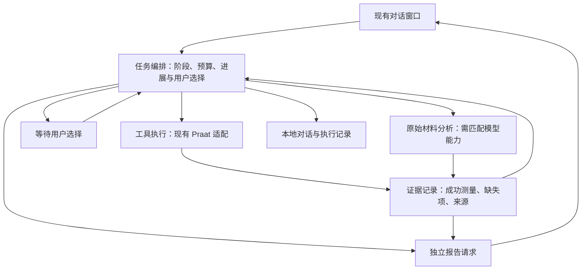

# AIPraat 架构讨论接续记录

整理日期：2026-10-02（北京时间）。

对话来源：[检查AI前端对话解析异常](https://chatgpt.com/s/cx_6abcc3859cbc8191b98a0ffc8e1882aa)。已读取分享页中全部展开显示的用户消息和答复；折叠的工具过程未逐项展开。

当前工作目录：`C:\Users\f2468\Desktop\Praat\稳定早期版`。本次核对了本机源码和相关文档。此目录没有 Git 元数据，不能据此推断它与其他电脑或远端分支的提交关系。

本文用于接续讨论。用户需求、历史诊断、代码现状和本轮建议分别记录；建议尚未成为已批准的实现规格。本次产出为文档，未修改产品代码或配置、安装依赖、调用用户的模型或发送用户音频。

## 1. 原对话讨论到了哪里

1. 用户报告最近三次分析回答不理想：提示相近，前两次未限制 token，出现重复工具调用、类似思考过程的文字及突然结束；最近一次要求分析选中的德语词发音，与柏林标准音比较并指出不足。
2. 诊断确认最近一次存在非法工具参数、重复调用和报告缺失。前两次原始响应没有完整保存，具体停止原因不能确定，不能统一归因为 token 截断。
3. 用户提出“阶梯逃逸”：脚本或工具遇到问题时，逐步放松专用前端的约束，让云端模型继续解释、分析和交付报告。
4. 前一轮提出三种路线：在同一会话里放宽提示；分开工具执行与报告生成；以直接音频聊天为主、Praat 按需辅助。推荐过第二条，但用户尚未批准最终架构。
5. 用户明确要求先查成熟设计，减少重复造轮子，并将查找范围扩展到语音以外。调研涵盖有序降级、停滞检测、策略切换、用户接管和熔断。
6. 原对话停在“继续比较 LangGraph 与较轻的 Python 流程封装，前端迁移作为独立选项”。尚未选择框架，也没有进入实现。

已有材料：

- [最近三次分析请求诊断](2026-09-30-ai-dialogue-diagnosis.md)。
- [失败降级与音频输入调研](2026-09-30-ai-fallback-research.md)。
- [通用阶梯逃逸调研](阶梯逃逸构想-general-fallback-research.md)。分享页里的原文件名为 `2026-09-30-general-fallback-research.md`，本机保存为此中文文件名。
- [现有架构决策记录](../ai/docs/adr/README.md)。

## 2. 用户已确认的要求

| 要求 | 依据 |
|---|---|
| 工具或脚本失败后，对话应能换一种方法继续完成任务 | 原对话的架构问题 |
| 上下文受限时，进一步扩展分析由用户选择；未启用限制时，可以自动转入 | 原对话用户偏好；本轮进一步明确自动收尾和点击继续的流程 |
| 先参考成熟设计，再决定方案，优先减少重复造轮子 | 原对话用户明确要求 |
| 第一阶段支持当前窗口内继续任务；关闭后保留记录即可 | 本轮用户答复 |
| 上下文低于阈值时，自动根据已有数据生成收尾报告，并提供进一步分析选项 | 本轮用户补充要求，随后明确确认四点流程；阈值具体数值仍需明确 |
| 点击进一步分析选项后，自动提交可见 prompt，在同一窗口用重新整理的上下文开始下一轮，复用成功测量 | 本轮用户明确确认四点流程 |

最后一条意味着：第一阶段需要持久保存对话和执行记录，运行中的任务状态可以留在内存。重开后恢复尚未完成的任务，不是当前要求。日志保存与工作流断点恢复应分别设计。

本轮澄清：此次收尾判断中的“限制”指上下文限制。回复长度上限是另一项设置，影响一次答复可生成的长度，不应直接代替上下文余量判断。原对话将两者合称“回复／上下文限制”，后续设计应分别命名和处理。

尚未确定：是否引入编排库、选择哪个库、是否迁移聊天界面、音频模型和供应商、纠错次数与停滞阈值，以及上下文收尾阈值的计算口径和默认值。低上下文时自动收尾、点击选项后继续，已成为用户要求。

## 3. 本机代码核对结果

以下为 2026-10-02 的只读源码检查，未重新运行云端或 GUI 故障复现。

| 现状 | 本机依据 | 对架构讨论的影响 |
|---|---|---|
| 云端工具循环仍限制为 8 轮、20 步 | `ai/praat_ai/chat.py:472` | 关闭 token 限制与工具循环上限是两个设置 |
| 重复调用被跳过并回灌，随后继续规划；没有单独的停滞恢复分支 | `ai/praat_ai/chat.py:785` | 防止重复执行还不足以退出循环 |
| 非法参数解析失败后留下空 arguments 和错误；回灌调用重新序列化空参数 | `ai/praat_ai/qwen.py:481`、`:580`；`chat.py:580` | 原诊断中的纠错信息和去重签名问题仍存在 |
| 收尾直接使用规划器的原 messages，未建立独立报告上下文 | `ai/praat_ai/chat.py:1013` | 失败历史仍会进入报告请求 |
| 收尾网络失败已有一次重试，随后以本地摘要保留结果 | `ai/praat_ai/chat.py:879` | 已有保留测量结果的措施，但不等同于完成用户分析目标 |
| TurnOutcome 主要包含 reply、results、notes、steps、failure | `ai/praat_ai/chat.py:532` | 没有显式任务阶段、证据覆盖、等待选择和目标完成状态 |
| 工具失败也可能将错误文本追加到 results | `ai/praat_ai/chat.py:847` | 字符串结果列表不能直接视为全部有效测量证据 |
| 最终答复后会再拼接工具结果，history 保存在窗口对象内存 | `ai/praat_ai/chat.py:2742`、`:1653` | 展示、证据保存和模型上下文需要分别处理 |
| 共振峰说明写默认 F1，实际默认 F2；schema 与多编号说明也不一致 | `ai/praat_ai/tools.py:431`、`:3232`、`:3535` | 引入框架不会自动修复工具契约 |

现有循环已经接收 planner、execute、refresh_context 和 on_progress 等接口（`chat.py:721`）。这是可复用的边界。现有工具模板、测量表、脚本投递与完成标记也应通过适配接口保留。

旧的总体设计文档主要面向本地小模型和确定性纠音流水线；云端开放分析应有明确的补充设计，避免把两种模型能力和约束混在一起。

## 4. 本轮建议：先明确职责，再选择编排组件

建议的产品目标是：Praat 测量为专业分析提供证据；单条测量链失败后，对话能在可用证据和模型能力范围内继续回答原始问题。



职责建议：

- **对话窗口**：展示进度、报告和进一步分析选项；点击选项后自动提交可见的用户 prompt，并启动下一轮。
- **任务编排**：持有原始目标、对象与选区快照、当前模式、剩余预算、失败分类及进展；核算上下文阈值，决定继续、修复、改道或收尾。
- **工具执行**：校验参数、生成和投递脚本、读取完成状态、同步对象上下文。返回结构化成功、失败或执行状态不明，保持 Praat 操作串行。
- **证据记录**：将有效测量与诊断文本分开，记录对象、范围、指标、单位、方法及质量提示，供报告和下一次请求引用。
- **报告生成**：以原始目标、有效证据、缺失项和已实际收到的原始材料重新构造请求。可以使用同一个模型，但不直接继承整串失败工具历史。
- **本地记录**：保留用户请求、阶段变化、工具原始参数和结果、模型结束原因、usage、错误及最终答复；排除 API 密钥等凭据。关闭后可查看，不承诺恢复执行。

框架能够复用的是调度、分支、重试等通用机制。Praat 的证据要求、失败分类、对象有效性及用户选择政策仍需由本项目定义。

## 5. 组件选择：当前范围下的三种路线

| 路线 | 可复用部分 | 主要代价 | 当前判断 |
|---|---|---|---|
| `pydantic-graph` 编排，保留现有模型客户端 | 有状态流程、显式节点和分支、逐步驱动 | 新依赖；异步流程需适配现有工作线程与 Tk 消息队列 | 优先评估的现成组件 |
| LangGraph 编排，保留 Praat 工具适配 | 条件路由、有限重试、错误分支、暂停恢复、检查点 | 框架集成与状态建模；Praat 副作用需避免恢复时重放 | 保留为主要备选 |
| 普通 Python 阶段函数与显式状态 | 直接使用现有回调和线程模式 | 需要维护阶段切换；随着流程增长，通用逻辑可能越写越多 | 若适配库的成本更高，可作小范围方案 |

**前一轮倾向**：保留现有 Tk 窗口、模型配置与客户端，以及 Praat 工具链，优先评估 `pydantic-graph` 的局部接入。

**阶梯设计细化后的建议**：`pydantic-graph` 管理 L0–L4 与路由，Pydantic AI 接管云端模型／工具会话、有限纠错和多模态适配，复用已有 Praat 工具与本地模型路径。该选择扩大了云端适配范围，用于减少相关机制的重复实现。具体边界、默认值和组件复用见[阶梯逃逸设计草案](2026-10-02-阶梯逃逸设计草案.md)。仍未验证依赖、打包和实际接入成本，框架尚未最终选定。

官方文档说明，`pydantic-graph` 是可独立使用的 Python 异步图／状态机库，不依赖 `pydantic-ai`。这使它可以承接流程控制而保留当前 Qwen 客户端。[来源](https://pydantic.dev/docs/ai/graph/graph/)

LangGraph 官方文档提供失败重试耗尽后的错误分支路由；当前文档将节点级 `error_handler` 标为需要 `langgraph>=1.2`。[来源](https://docs.langchain.com/oss/python/langgraph/use-graph-api#handle-node-errors)

LangGraph 的 interrupt 恢复会重新执行所在节点，所以 Praat 操作应与等待选择拆开，不能仅靠引入检查点保证操作不重复。[来源](https://docs.langchain.com/oss/python/langgraph/interrupts#side-effects-called-before-interrupt-must-be-idempotent)

第一阶段无需跨重启恢复，降低了持久化工作流在本次选型中的权重。它仍可使用内存状态；官方文档明确区分内存检查点与跨重启持久存储。[来源](https://docs.langchain.com/oss/python/langgraph/persistence)

LibreChat／Open WebUI 的前端迁移可以单独评估。它改变部署、界面及本地 Praat 接入范围；当前窗口内恢复的需求本身不要求迁移。

## 6. 阶梯如何工作：待讨论的规则

阶梯应是程序可选择的工作模式，每种模式明确输入、工具、提示词和输出要求。切换不依赖不断追加“忽略此前限制”。

| 信号 | 建议处理 |
|---|---|
| 可修正的参数或对象错误 | 保留原始调用与具体错误，允许有区别的有限修正 |
| 临时网络故障 | 有限重试；工具执行超时且副作用不明时，先核实执行状态 |
| 重复失败或调用没有增加有效证据 | 停止该失败分支，选择其他方法或进入报告阶段 |
| 缺失依赖／当前对象不支持 | 直接改道，避免消耗预算反复尝试同一种方法 |
| 上下文可用预算低于收尾阈值 | 自动停止新增分析，使用已有数据生成报告，提供点击后继续分析的选项 |
| 已有证据能支持主要结论 | 根据已有证据生成报告，列出未完成部分 |
| 关键证据不足，原始材料可用且模型支持 | 按用户政策进入原始材料分析 |
| 原始材料也不可用 | 解释可判断范围，提供一般知识与必要的补充问题 |

“有进展”至少包括新取得的有效证据、确实恢复的能力或已解决的关键错误。仅改变参数文本、重复返回缓存结果、输出更长的计划，不应自动算作有进展。具体阈值尚未确定。

对工具的暂停范围应考虑对象、时间区间和操作意图；一次共振峰调用失败，不应永久禁止所有对象和范围的共振峰查询。

每次改变模式仍保留用户原始目标、明确限制和证据来源。直接分析音频要求相应模型能力；音频是否实际发送、测量与定性判断的区别应可追溯。

## 7. 上下文阈值、自动收尾与点击继续

### 用户已明确的交互

上下文低于阈值 → 自动根据已有数据生成收尾报告 → 显示进一步分析选项 → 用户点击 → 自动提交 prompt → 开始下一轮会话。

自动收尾无需先等待选择。用户的选择发生在继续分析处。这更新了上一版记录中尚未确认的收尾边界。

### 阈值计算建议

建议将“上下文低于阈值”解释为**剩余可用上下文低于阈值**。这里是设计建议；用户尚未明确区分“配置的总窗口较小”和“本轮剩余空间不足”，不能把计算口径写成已经确认的原话。

可用预算按 token 计算，至少考虑：

- 有效上下文上限：配置的上限，以及已知的模型实际容量。
- 下一次请求的完整预计输入：系统提示、工具定义、历史、当前目标与工具结果。
- 收尾回答的预留预算和估算误差的安全余量。

判断可表达为：

```text
剩余预算 = 有效上下文上限 − 下一次请求预计输入量
收尾阈值 = 收尾回答预留预算 + 安全余量

剩余预算 < 收尾阈值 → 自动进入收尾阶段
```

预留预算仍应服从用户配置的回复长度上限。下一次工具结果可能很大时，还需预留或限制其输入量，避免等结果回灌后才发现超限。具体默认值和安全余量尚未选择。

本机 `qwen.estimate_tokens`（`ai/praat_ai/qwen.py:352`）当前使用字符估算，不能将其结果展示成精确 token 数。后续可用供应商返回的 usage 校准估算；每次新请求仍需重新核算完整输入。

当前 `fit_messages`（`ai/praat_ai/chat.py:933`）在超预算时删除旧历史并截短工具结果。新增收尾判断宜放在预算裁剪和下一次规划之前，避免先丢失关键证据再收尾。完整测量记录应独立保存；报告请求使用能够容纳的证据摘要。

### 收尾报告和继续选项

报告应交代已有结论、成功测量、缺失证据及可继续分析的问题。界面可提供“继续深入分析”或与缺失项对应的具体选项；选项描述应明确下一轮会做什么。

建议将“下一轮会话”落实为**同一聊天窗口中的新分析轮次，使用重新整理的模型上下文**。窗口保留之前的报告和记录；下一次模型输入由原始目标、对象与选区、有效证据、未完成项和所选分析方向重新构造。

点击后的自动 prompt 应在聊天中可见，保留相应选项和提交记录。示意内容：

> 继续分析原始任务。沿用已有测量和目标片段，重点处理所选的未完成问题；复用有效结果，仅补充必要分析，交代新增证据和剩余缺口。

该示意需结合实际任务生成。点击后沿用当前上下文与回复设置，工具执行前重新核实目标对象和范围；若选择音频分析，则另按实际模型能力构造输入。

重新整理上下文后，应检查是否足以开展一次有意义的后续分析。若最小输入和输出预算仍放不下，显示需要缩小分析范围或调整设置的原因，避免点击后立即再次自动收尾。运行中防止重复点击产生多个并发任务；工具操作仍串行。

### 后续验证范围

验证应覆盖：阈值前能正常分析；跨过阈值自动收尾并保留证据；点击选项会提交一次可见 prompt；新上下文包含原目标和已取得证据；已有成功测量得到复用；下一轮预算不足时有明确反馈；停止按钮能结束后续步骤；关闭后能查看记录。

非法参数纠错、重复调用退出、部分测量失败后的报告，以及未启用限制时的自动改道，仍需一并验证。工具执行成功与用户目标完成分别报告。

用户随后明确确认了四点交互流程，并要求继续讨论阶梯本身的能力释放、触发条件和具体库复用。已据此形成[阶梯逃逸设计草案](2026-10-02-阶梯逃逸设计草案.md)。用户进一步确认了五级阶梯、一次修正／两轮停滞的初始策略及 Pydantic 生态方案，并要求补充应对模型是否具备直接音频分析能力的机制；新增设计记录在该文档第 11 节。上下文收尾阈值的具体默认值和依赖实际版本仍待选择；尚未实施或验证音频端点。

后续用户明确要求：API 配置中增加直接音频分析能力选项，填写模型名时按预设自动选择，允许手动修改；误将无能力模型设为有能力时，收到明确的不支持音频错误后自动关闭该设置并继续降级路径，在思考／执行过程区提示。已写入第 11 节修订版。该选项管理支持原始音频输入的多模态大模型，与现有 MFA／wav2vec2 专业对齐工具分别处理；超时、限流、授权或格式问题不应误触发持久能力纠正。

用户认可后要求再次复核待明确事项。复核记录见阶梯设计第 12 节：用户已明确首版仅使用当前一个 API，按能力进入音频或证据分析，双模型配置后续再加；相关路由与库复用范围已统一。建议补齐原目标片段绑定、逐项目标覆盖、物理上下文与全局工作量边界、分阶段 Praat 依赖及记录／临时材料范围。具体依赖版本和协议接入由开发验证，不作为重复的用户设计确认。

用户最终认可复核后的默认规则，明确原始音频仅保留记录和材料来源，不长期存档，并要求转到新对话开始构建。当前窗口可使用应用创建的临时片段快照，关闭后清理这些临时副本；用户源文件保留。设计已更新为已确认状态，新构建对话依据设计形成实现计划并开始实施。
