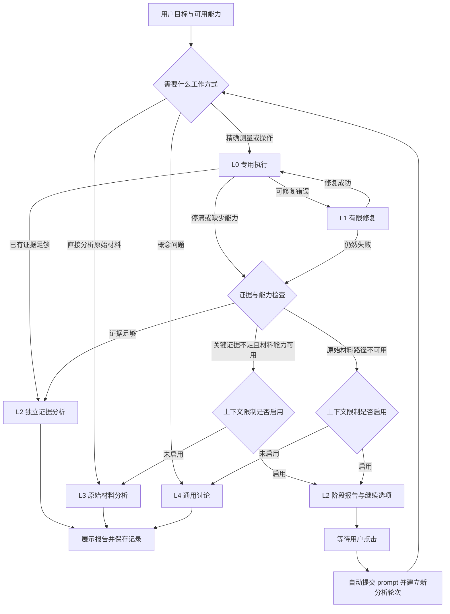

# AIPraat 阶梯逃逸设计草案

日期：2026-10-02（北京时间）。状态：用户已确认主要方案与第 12 节的默认规则，明确首版仅使用当前一个 API，原始音频只保留记录和材料来源，并要求转入新对话开始构建。本对话尚未实施产品代码。

前置约定见[架构讨论接续记录](2026-10-02-架构讨论接续.md)。用户已确认：上下文预算低于阈值时自动收尾；展示进一步分析选项；点击后自动提交可见 prompt；在同一窗口用重新整理的上下文开始下一轮，复用已有成功测量。

本文记录工作模式、切换规则和具体复用组件。用户已确认五级阶梯、一次修正、两轮停滞及 Pydantic 生态的方案，随后要求补充应对模型是否具备直接音频分析能力的机制，并明确要求 API 配置中的能力选项、模型名预设、错误时自动纠正及过程提示。初始阈值可在后续实际验证中调整；上下文收尾阈值的具体默认数值仍待选择。未修改产品代码、安装依赖或发送用户音频。

## 1. 目标与基本判断

目标是让 Praat 提供可靠的专业证据，让云端模型在某条工具链失败时仍能综合解释、选择其他输入并完成可支持的答复。

本机 `qwen.py` 已将云端工作流与本地小模型提示分开，开放知识模式允许一般知识、推导和 Markdown。当前的主要束缚是工作流优先完成测量，以及规划与收尾共享失败历史。

因此，能力释放应落实为：切换工作角色、工具集合、输入材料和上下文。在进入独立分析模式时解除“先完成工具测量”的流程要求。用户明确选择的知识模式、对象范围及配置上限继续生效。

工作模式与收尾状态分别建模：L0–L4 表示如何工作；报告完成、部分完成、等待选择和取消表示本轮如何结束。任何一级都可能收尾。

## 2. 五级工作模式

| 级别 | 角色与能力 | 输入、工具与表达 | 典型进入条件 |
|---|---|---|---|
| L0 专用工具执行 | 用 Praat 测量、操作对象，按任务逐步建立证据 | 当前对象状态、目标片段、工具 schema；使用已注册工具；一般知识按配置从开始即可用于解释 | 请求需要实际测量、标注或对象操作，相关能力可用 |
| L1 有限修复 | 针对具体错误修正参数、对象或可明确修复的脚本问题 | 保留原始错误与必要调用上下文，缩小纠错范围；只允许有区别的有限尝试 | 可修正的参数错误、状态变化或临时故障 |
| L2 独立证据分析 | **解除工具执行优先的角色约束**，综合成功测量、用户材料、推导、一般知识与假设 | 新建分析上下文；普通 Markdown；不注册 Praat 执行工具；缺失指标可明确标为未完成 | 已有证据足够；纠错失败或停滞；上下文阈值触发自动收尾 |
| L3 原始材料分析 | **增加原始输入能力**，直接分析音频、图像或其他已支持材料，并结合既有测量 | 新建多模态请求；匹配输入的模型；原始目标、目标材料、证据摘要和缺失项；保持分析与测量来源可区分 | L2 的关键证据不足，目标材料可取得且有可用的相应模型 |
| L4 通用讨论 | 讨论原理、一般参照、可能原因、练习方法和所需补充信息 | 精简对话上下文；按知识模式使用一般知识；不调用失败的 Praat 分支，不推断未提供录音的具体缺陷 | 原始材料或对应能力不可用；任务本来就是概念讨论 |

L2 是从专用执行角色中释放模型分析能力的明确边界。正常测量完成后也进入 L2，能力释放不必等待故障。L3 扩展实际输入能力；L4 则交付当前证据条件下可进行的通用讨论。

入口按用户目标分流：概念问题直接 L4；用户明确要求直接分析原始材料且条件满足时直接 L3；实际 Praat 操作和精确测量进入 L0。

## 3. 什么信号触发切换

建议初始策略：

| 信号 | 初始处理规则 | 去向 |
|---|---|---|
| 参数非法、缺参数、对象类型错误 | 给出原始调用与具体错误；同一问题允许 **1 次有区别的修正** | L0 → L1；修正成功回 L0，仍失败退出该分支 |
| 明确可修复的脚本错误 | 一次有依据的修正；没有明确修正依据时立即退出该分支 | L1 或恢复路由 |
| 模型服务临时超时、限流或服务端故障 | 初始请求加 **最多 1 次重试**，计入总预算；不能突破用户取消 | 首版在当前 API 重试；仍失败时保存结果并说明失败 |
| 工具执行超时且是否执行不明 | 先读取请求编号对应的开始、完成和失败标记；核实对象状态 | 核实后再决定；状态不明时暂停该操作，不盲目重新执行 |
| 同一问题在修正后再次失败 | 同一问题累计两次失败，暂停对应任务分支 | 恢复路由选择 L2、L3 或 L4 |
| 连续两轮规划没有有效进展 | **2 轮**没有新增有效证据、已解决缺口或确实恢复的能力，停止当前执行分支 | 恢复路由选择 L2、L3 或 L4 |
| 没有对应工具或依赖缺失 | 将能力标为不可用；不等待重复失败阈值 | 直接恢复路由 |
| 已有证据覆盖用户主要目标 | 停止新增测量 | L2 |
| 上下文余量低于阈值 | 停止新增分析，按已确认流程自动报告并显示继续选项 | 当前模式 → 收尾；点击后新一轮重新路由 |
| 用户点击停止 | 保存已经执行的结果，结束后续规划与请求 | 取消；后续继续需新的用户动作 |

“同一问题”的分组建议包括目标子问题、对象／输入版本、时间范围和操作意图。原始参数用于诊断与具体动作去重，但修改参数文本不能无限重置修复预算。

“有效进展”包括新的可靠测量、有效的负面观测、消除关键歧义或恢复确实可用的能力。重复缓存结果、增加计划文字、循环切换对象、改参数但继续得到同类错误，都不能单独重置停滞计数。

工具的实际状态至少区分：成功、失败、未执行和执行结果不明。被去重、被规则阻止或尚未发出的调用，不应统一标成执行成功。

## 4. 恢复路由如何选择目标阶梯

每次退出一个工具分支，依次判断：

1. **已有证据能否支持原始目标的主要结论？** 能则 L2。结论可包含明确的未完成部分。
2. **缺少的是否为关键证据？原始材料和相应模型是否可用？** 满足时 L3 是下一候选；音频分支先通过第 11 节的能力检查。
3. **L3 不可用时，是否能交付一般解释和具体下一步？** 能则 L4，并标明目标仍有哪部分未完成。
4. **模型服务本身全部不可用？** 保存和展示已有结果及失败原因。框架不能保证此时仍生成新的模型分析。

上下文限制启用时，普通 L2 报告自动生成；进一步进入 L3／L4 的分析选项由用户点击启动。未启用限制时，可以按预先配置的能力自动进入适合的模式，并记录原因。用户明确要求的直接材料分析或概念讨论按入口分流执行。

启用限制且关键证据不足时，先输出 L2 的阶段报告和可继续选项。未启用限制、关键证据不足且 L3 可用时，允许 L0／L1 直接到 L3。依赖永久不可用时也可以跳级。

同一轮退出的失败分支保持暂停，L2–L4 不自动恢复它。用户点击继续或提供新材料后开始新的轮次；重试该问题需要新依据，例如参数已修正、对象变化或依赖已恢复。上一轮失败原因随证据摘要保留。

上下文预算和用户取消属于所有模式共同检查的条件；图中省略了这些公共边，以便突出恢复路由。图中每条进入 L3 的路径均须先检查材料和对应输入能力；音频验证与替代路径按第 11 节处理。

## 5. 如何构造释放后的上下文

L0／L1 使用专业工作流角色、证据规则和工具定义。L2–L4 使用相应的分析角色与证据规则，移除操作规划要求及失败工具历史。

所有分析模式复用当前 `qwen.analysis_instructions(config)` 中的身份、证据和用户知识模式规则。L2–L4 不叠加 `CLOUD_WORKFLOW_INSTRUCTIONS` 的“先完成相关测量”要求。

新上下文包括：原始目标、需要交付的子问题、目标对象／材料和范围、成功证据及来源、失败导致的缺失项、可用能力、用户明确限制。失败历史压缩为原因和已尝试方法，完整调用记录留在本地。

自由表达包括综合解释、比较、透明推导、提出假设、组织报告和练习建议，仍按用户知识模式决定是否可用一般知识。没有实际音频输入时，听感判断保持为不可用。

报告需要交代原始目标的每个重要部分。结构上的覆盖可以用完成／部分完成／缺证据状态检查；不能把格式验证当作结论正确性的验证。报告只有统计表、没有所需对比和解释时，允许最多一次定点修正，之后明确返回未完成状态。

## 6. 具体复用的库与 API

建议采用同一 Pydantic 生态的流程和模型组件，并增加现成 JSON Schema 校验器。第一阶段使用当前窗口中的内存任务状态，记录持久化另行处理。

| 组件 | 具体复用 | 本项目负责的部分 |
|---|---|---|
| **pydantic-graph** | `GraphBuilder` 的步骤与条件分支；`graph.iter()`、逐步驱动与状态检查 | L0–L4 的业务模式、停滞信号、目标路由、等待选择和报告阶段 |
| **Pydantic AI** | `Agent`／`Agent.iter()` 的模型—工具会话；`ModelRetry` 的定点纠错；有限 tools/output retries；`UsageLimits` | 将现有工具适配进去；在每步后检查证据、预算和切换信号；全局预算与取消 |
| **Pydantic AI 工具适配** | `Tool.from_schema(...)` 包装现有工具 schema；Praat 工具设置 `sequential=True`，共用单一串行投递器 | 对象、范围、脚本和操作权限校验；输出转换为有效证据或诊断 |
| **jsonschema** | 对动态工具参数使用 `Draft202012Validator`／错误列表，复用同一份工具 schema | 把验证错误转换为可修复反馈；统一现有 schema、说明和默认值 |
| **Pydantic AI 模型与多模态适配** | 兼容 API 的 `OpenAIChatModel`／相应 Provider；原始材料使用 `BinaryContent`、`AudioUrl` 等 | 对实际端点、地域、模型与输入类型做能力匹配；导出目标材料，保留来源 |
| **Pydantic AI 服务 fallback（后续扩展）** | 多模型版本可复用 `FallbackModel`，按异常或响应条件选择已配置备用模型 | 首版只使用当前 API，不启用自动备用模型切换；后续限制候选与触发条件 |
| **Python 标准库** | `sqlite3` 保存会话／轮次／事件；`json` 保存结构化内容；现有 Tk 队列 | 对话、脚本、证据、切换原因与继续 prompt 的记录和展示 |

`pydantic-ai-slim` 可按所需 Provider 选择依赖；兼容 Chat Completions 路径可评估 `[openai]`。尚未选择实际版本或安装依赖。[官方安装说明](https://pydantic.dev/docs/ai/overview/install/#slim-install)

`pydantic-graph` 支持逐步运行和条件节点，适合检查阶段边界；当前文档明确其图状态不自动做持久快照。该限制与第一阶段仅在当前窗口继续的要求相符。[Graph Builder](https://pydantic.dev/docs/ai/graph/builder/)

Pydantic AI 的工具重试和输出重试分别配置；SDK、网络传输和 Agent 的重试预算可能叠加。设计中要求限制重复的底层重试，所有实际模型请求计入同一轮总账，避免多个层各自反复尝试。[重试机制](https://pydantic.dev/docs/ai/core-concepts/retries/)

**关键适配细节**：`Tool.from_schema` 不会自动按所提供的 JSON Schema 验证工具参数。因此需接入 `jsonschema` 和现有业务检查，不能仅包装 schema 就认定参数问题已经解决。[工具 API](https://pydantic.dev/docs/ai/api/pydantic-ai/tools/#pydantic_ai.tools.Tool.from_schema)、[JSON Schema 校验](https://python-jsonschema.readthedocs.io/en/stable/validate/)

`UsageLimits` 可限制请求、token 和工具调用；其部分指标为累计用量，工具次数限制与项目对所有失败尝试的计数也不相同。上下文阈值仍需在每次请求前按完整输入单独核算；本项目的所有工具尝试和无进展轮次独立计数。[用量限制](https://pydantic.dev/docs/ai/core-concepts/agent/#usage-limits)

原始音频可由 `BinaryContent` 或 `AudioUrl` 表达，但仍要求所选模型支持音频。`FallbackModel` 解决模型请求失败后的服务选择，不自动完成 Praat 任务的进展判断或阶梯切换。[多模态输入](https://pydantic.dev/docs/ai/core-concepts/input/#audio-input)、[模型 fallback](https://pydantic.dev/docs/ai/models/overview/#fallback-model)

LangGraph 保留为替代编排方案。当前推荐先选 Pydantic 生态，避免同时引入两套流程引擎。若实际接入表明 LangGraph 更适合，则替换编排选择，而非将两套引擎叠加。Vercel、Magentic、Haystack 等用于参考模式，其运行时暂不纳入本机 Python/Tk 架构。

## 7. 本项目已有代码如何复用

| 现有代码 | 保留和适配方式 |
|---|---|
| `ai/praat_ai/tools.py` 的 `tool_schemas()`、`render()`、对象类型与范围检查 | 作为工具注册和执行的来源，补齐契约不一致后交给 Pydantic AI 包装 |
| `ai/praat_ai/measures.tsv` 与生成的 Praat 插件 | 保留确定性测量定义和算法；阶梯不改写成功测量值 |
| `chat.py` 的 `render_action()`、`_execute_action()`、执行回调 | 提取为专用执行适配，返回结构化结果；不再由 UI 文件承担全部模式路由 |
| `chat.py` 的请求编号、脚本前导、结果等待及完成标记 | 保留一请求一脚本和完成关联；核实超时、取消与执行状态 |
| `sendpraat.py` 的 `build_message()`、`deliver()` 等 | 保留正在运行的 Praat 消息投递机制和串行约束 |
| `qwen.py` 的 `analysis_instructions()`、身份与知识模式规则 | 跨 L0–L4 复用；各阶段增加自己的角色与任务输入 |
| `config.py`、API 配置窗口和模型选择 | 沿用用户配置，增加阶段能力与阈值配置时保持现有字段含义 |
| `extract_part`、`save_sound` 及外部脚本已有 WAV 导出逻辑 | 为 L3 导出目标片段；需处理临时对象、原始范围和导出文件校验 |
| `ChatWindow` 的消息队列、历史显示、取消事件与折叠展示 | 添加报告后的继续选项和可见 prompt；Tk 操作仍在主线程 |
| `audio.py`、`pronunciation.py`、`report.py` | 保留现有确定性声学／纠音流水线与报告；通用聊天报告另用适合的结构 |

若采用 Pydantic AI，云端的 `_NativePlanner`／`_JsonPlanner` 会话管理交由其承担；现有 `QwenClient` 的本地路径保留。云端请求字段、思考档位、端点和不支持字段的兼容行为需迁移或适配，并重新验证。这比上一轮仅引入流程库的范围更大，换取工具纠错和多模态协议等机制的直接复用。

建议拟新增的项目职责为：`escape_policy`（阶段与路由）、`evidence`（有效观测与缺失项）、`cloud_agent`（库与现有工具适配）、`conversation_store`（本地记录）、`model_capabilities`（能力登记、验证与可用性）。它们描述项目规则，不实现新的通用 Agent 框架。

## 8. 本机当前可以到哪一级

只读配置检查显示本机选用 `qwen3.7-flash`，上下文限制当前关闭。官方输入能力表列出 Image、Text、Video，未列音频；因此该配置不能被直接认定为可进入音频 L3。提示词切换无法增加模型不支持的输入能力。[阿里云模型文档](https://help.aliyun.com/zh/model-studio/qwen3-7-flash)

L0／L1／L2／L4 可以围绕文本模型和现有测量设计。L3 的图像或音频分支分别检查实际模型、端点和输入协议。听音频分析需要配置支持音频的模型并核实适配路径；按第 11 节可以先依据预设／手动设置尝试实际分析，独立音频测试为可选操作。当前 `qwen.probe_api()` 仅发送文本 `ping`，已有“测试连接”成功不能作为音频验证结果。

框架 API 已根据官方文档核对，但未在本机安装或运行验证。Python／Tk 环境、打包体积、供应商请求兼容和实际多模态调用成本仍需实现前核查。

## 9. 用原始德语请求检验路由

原始目标：分析选中的德语词发音，与柏林标准音比较并指出不足。

1. L0 读取对象、目标选区，取得相关测量。原始目标一直保留。
2. 共振峰参数非法，进入 L1；将原参数与具体错误交给模型，允许一次定点修正。
3. 再次失败时暂停这条共振峰分支。其他成功测量保留为证据。
4. 整段 F0、强度和单个 F2 统计不足以支持具体音素的全面判断，恢复路由将原始音频分析列为候选。
5. 有限上下文模式先生成 L2 阶段报告，按能力状态提供“分析目标片段音频”“设置或验证音频能力”或“配置支持音频输入的大模型”等选项。配置操作本身不启动分析；用户点击可执行的分析选项后自动提交 prompt，以证据摘要开始新轮次；验证失败则继续有证据的分析并说明缺口。
6. 未启用限制且当前 API 音频路径已配置可用时，自动进入 L3。首版当前 API 配置缺少音频能力时，用已有证据进入 L2，并在适合时转 L4。具体录音诊断仍未完成的部分明确标出；双模型配置留待后续。

如果原问题只要求解释语调，F0 等证据可能已经足够，直接 L2。如果用户问的是德语重音的一般规则，可从入口直接 L4。

## 10. 已确认选择与后续验证重点

用户已确认的核心选择：五级职责边界；一次修正与两轮停滞的初始值；有限上下文时先报告再由点击扩展；Pydantic 生态接管云端会话的范围。

后续验证重点：非法 JSON 和原参数留存；同一问题改参数无法无限重试；A→B→A 循环可被识别；成功测量能进入报告；概念问题直接讨论；关键证据不足的材料路由；模型无音频能力时跳过对应选项；上下文阈值提前收尾；继续 prompt 和新上下文；供应商与 Agent 重试总预算；取消和执行状态不明的操作。

尚未开始实现计划。已确认的阶梯方案与下述新增机制共同构成后续实现计划的设计输入。

## 11. 音频能力判定与路由（补充设计）

### 11.1 判定对象与能力边界

本文的“音频模型”专指**支持原始音频输入的多模态大模型**，可通过 API 接收音频和分析指令并返回文字解释，例如具备该输入能力的 Qwen-Omni、Gemini 模型。后续界面和说明采用这个具体名称，避免与专业声学模型混淆。[Qwen-Omni 音频说明](https://help.aliyun.com/zh/model-studio/qwen-omni)、[Gemini 音频理解](https://ai.google.dev/gemini-api/docs/audio)

MFA 主要用于根据转写、词典和声学模型确定音素／词的时间位置；wav2vec2 是语音表征模型家族，可通过相应任务模型用于识别、分类等。本项目 `forced_alignment.py` 中的 `MfaAligner`、`Wav2Vec2Aligner` 属于音素对齐工具，输出结构化的边界与置信度，供测量和 L2 解释复用；它们不由这个 API 音频能力选项管理，也不等价于能执行开放式音频讨论的聊天模型。[MFA 说明](https://montreal-forced-aligner.readthedocs.io/en/v3.4.0/user_guide/index.html)、[Wav2Vec2 说明](https://huggingface.co/docs/transformers/model_doc/wav2vec2)

新增一个供入口分流、恢复路由、继续选项共用的能力检查。检查对象是“模型 + 实际端点 + 请求协议 + 本机适配器 + 账号配置”，不能只按模型名称判断。

至少分别记录：

- `audio_input`：模型可通过当前协议接收原始音频，并用于音频内容／听感分析。
- `transcription`：可将语音转换为文字；不由此推断具备声学或发音比较能力。
- `audio_output`：能合成语音；不由此推断能理解音频。
- `text_output`：当前请求路径可返回分析文本，符合本产品报告需要。
- `input_constraints`：可用格式、编码、大小／时长限制，以及是否要求流式调用等协议约束。

直接音频输入的功能验证与特定任务的准确度评估分别处理。能够识别测试音频，不代表能够可靠测量共振峰或判断细微发音差异。精确声学数值继续来自 Praat 等确定性测量；模型听感和解释保留其来源及不确定性。

### 11.2 支持情况、可用性与验证依据分别存储

内部记录建议包括：

| 字段 | 取值或内容 |
|---|---|
| `support` | `supported`、`unsupported`、`unknown` |
| `availability` | `ready`、`unknown`、`temporary_error`、`auth_error`、`adapter_missing`、`format_mismatch` |
| `verification` | `unverified`、`documented`、`probed`、`observed`、`manual_declared` |
| `reason`／`source`／`checked_at` | 判定原因、官方能力资料或本机验证记录、时间 |
| `constraints` | 适用的输入格式和限制；不完整的信息保持未知 |

界面可归纳显示“音频已验证可用”“不支持音频”“音频尚未验证”“音频暂不可用”，同时显示原因。适配器缺失、格式问题和账号问题显示具体原因；不能改写为模型不支持。

能力资料按供应商、端点、地域和明确模型版本登记。官方能力资料与框架元数据用于筛选候选；已有端点验证用于判断当前调用路径。自定义网关的别名、未收录模型、资料冲突、库字段缺省，均保留未知或待核实；用户可补充资料并主动验证。记录相互冲突时先核实实际模型映射，不将一次测试结果扩大到所有同名模型。

特别注意：当前 Pydantic AI 的 `supports_audio_input` 默认值为 `False`，文档说明该字段用于实时会话历史交接，且当前内置 profile 尚未将其设为真。因此本项目不能直接把该缺省值作为“模型不支持音频”的完整能力目录。[ModelProfile 官方说明](https://pydantic.dev/docs/ai/api/pydantic-ai/profiles/#pydantic_ai.profiles.ModelProfile.supports_audio_input)

### 11.3 API 能力选项与模型名预设（用户明确要求）

在 API 配置窗口的模型名附近增加复选框：**“模型具备直接音频分析能力（可输入原始音频）”**。下面显示依据：“模型预设”“用户设置”“接口自动纠正”或“未收录，默认关闭”，以及可用性原因。这是应用的音频路由设置；勾选本身不能证明模型的真实能力。

填入或更换模型名时，自动匹配内置预设并设置默认勾选状态。保留手动修改的自由；未收录模型默认不勾选，但显示能力未知，而不是宣称模型不支持。旧配置缺少新字段时按同样规则初始化，不要求用户重新填写 API。

预设使用供应商范围内的明确模型名和明确收录的别名，不按 `flash`、`omni` 等单个词猜测整个家族。条目保留官方来源、资料日期及已知协议要求；模型版本未知则保留未知。示例初始条目如下，实际实现时还需逐项核对所选适配器：

| 模型名 | 默认勾选 | 依据及路由注意 |
|---|---|---|
| 百炼 `qwen3.7-flash` | 否 | 官方列出 Image／Text／Video，未列音频；[能力表](https://help.aliyun.com/zh/model-studio/qwen3-7-flash) |
| 百炼 `qwen3-omni-flash` | 是 | 官方音频输入说明；调用须遵守对应流式协议；[说明](https://help.aliyun.com/zh/model-studio/qwen-omni) |
| 百炼 `qwen3.8-omni-flash` | 是 | 官方音频输入说明；[说明](https://help.aliyun.com/zh/model-studio/qwen-omni) |
| Google `gemini-3.8-flash` | 是 | 官方音频理解示例；原生 API 支持不能自动证明自定义兼容网关支持；[说明](https://ai.google.dev/gemini-api/docs/audio) |
| 未收录名称／未明确映射的自定义别名 | 否 | 保留未知，可手动启用或主动验证 |

自定义网关使用官方模型名时，可以提供名称对应的候选预设，但将依据显示为“按名称推定，网关未验证”。网关别名有明确映射才应用相应条目。最终请求还需检查适配器、协议与材料约束。

保存建议包括 `audio_input_enabled`、`audio_input_source`、`audio_input_reason` 与对应路径标识；字段名为设计建议。内部能力事实、当前可用性继续按 11.2 独立保存，不把路由开关当作完整事实。

读取配置时的优先顺序为：当前路径仍有效的接口纠正记录 → 已保存的手动设置 → 模型名预设 → 未知时默认关闭。预设只初始化新路径的默认值，不能每次打开窗口都覆盖手动选择或接口纠正。只有模型／端点等关键配置变化，或用户主动重新启用并验证时，才解除对应的纠正记录；同一路径更新 API Key 时重新核实可用性。

### 11.4 错误时自动纠正并继续（用户明确要求）

当用户误勾选不支持音频的模型，首次音频请求收到明确的模型／端点不支持音频错误时：

1. 停止本轮该路径的音频请求，不对相同输入再次重试。
2. 立即将该路径的 `audio_input_enabled` 改为 `false`，依据标为“接口自动纠正”，保留具体原因与时间；只纠正音频设置。
3. 更新内存路由和打开中的配置窗口复选框，并将纠正写回当前对应配置。更新前比较发请求时的配置标识，避免用户中途切换模型后误改新模型。保存失败时内存降级仍生效，并显示未保存原因；后台更新不能覆盖独立 API 配置窗口刚保存的其他字段。
4. 首版进入没有直接音频能力的路径，以已有测量／转写进入 L2；关键缺口保留，L4 扩展继续遵守上下文与点击规则。成功测量不重跑；不会自动换到未配置的模型。
5. 在界面现有“正在思考和计算”的过程区追加简短提示，并保存为本轮事件。这是应用自己的能力判定与执行记录。

提示示例：

> 当前 API 模型／端点不支持音频输入，已自动关闭“直接音频分析能力”设置。本轮改用已有 Praat 测量继续分析；缺少听感证据的部分将在报告中说明。

若错误只能证明当前网关／协议不接受音频，提示写“当前 API 路径不接受音频”，不扩大为模型在所有端点都不支持。纠正对具体配置有效，官方模型资料仍保留。

以下情况不触发“不支持音频”的持久纠正：超时、限流、服务故障、账号错误、音频格式／大小／时长错误，或仅因模型回答不佳、口头声称不能听音频。供应商适配器将明确能力错误归一化；未知 400 错误保留原始诊断并按有限修复处理，不把任意错误当作能力缺失。

模型静默忽略音频时，接口未必提供可分类的错误。功能验证可以降低该风险，但不能保证识别所有静默错误；没有实际音频使用证据时，报告不能声称已听取材料。

### 11.5 可选验证实际音频调用路径

API 配置中保留现有“测试连接”，另提供可选的“验证音频能力”。名称预设或手动启用可作为第一次实际音频分析的路由依据，仍标明尚未实测，不强制先做独立探针。音频验证使用随程序提供或本地生成的短测试音频，不使用用户录音充当隐式探针。

建议一次测试中包含简单的声响数量或音调变化，预期特征随机选择且不写入提示词、文件名或元数据。提示只要求识别特征；程序用明确答案校验。该测试用于排查音频被忽略或仅传入转写文本等基本问题，不用模型自述“我可以听音频”作证据。

判定至少需要两层：实际协议接受音频；返回内容能够回答依赖音频的问题。仅 HTTP 成功、空答复或泛泛描述不能升级为已验证。基础题答错只表示验证未通过／结论不确定，不能证明模型永久不支持，也不能用测试通过证明供应商内部采用何种处理方式。

错误分流：

| 结果 | 更新状态与后续行为 |
|---|---|
| 请求成功，音频特征校验通过 | 当前路径标为基础功能已验证；记录测试范围 |
| 返回成功但内容无法证明使用了音频 | 保持未验证，记录结果；不自动反复测试 |
| 合法请求被明确拒绝，错误明确指出当前模型／端点不支持音频 | 按 11.4 自动关闭当前路径的音频设置，保留原始错误和范围并提示 |
| 格式、编码、大小、字段或协议错误 | 格式／适配问题；有明确修正依据时按有限修复策略处理 |
| 401／403 | 账号或授权不可用；不改写模型固有能力 |
| 429、5xx、网络超时 | 临时不可用；保留之前的支持证据 |

一次验证流程仍服从已确认的重试上限与全局预算：初次请求加最多一次有依据的重试，同轮同路径不启动新的验证循环。明确不支持或本机适配器不存在时直接跳过探针。取消立即停止后续请求。

缓存按端点、模型、地域、协议／适配器版本和本地账号配置标识绑定；不保存密钥。修改这些配置后重新验证。支持证据可持久保存，但旧的可用性不能永久视为有效：记录时效，过期重新确认；临时故障只作短期退避，并提供主动重试。持久缓存不意味着关闭后恢复未完成任务。

### 11.6 接入阶梯与模型选择

用户已明确：**首版仅使用当前一个 API**。同一个模型按其配置与实际能力执行专用规划、证据分析或直接音频分析。当前 API 不支持音频时进入 L2／L4；用户仍可主动在现有 API 配置界面更换模型，新配置从后续请求生效。

执行 L3 时，当前模型接收原始目标、目标音频、成功测量和关键缺口，返回听感分析及证据来源。结果进入共同证据记录；后续在 L2 综合整理时，原始音频、测量结果、转写与模型推断分别标记，避免二次汇总把推断写成测量事实。

额外音频专用 API 和任务内自动模型选择留待后续版本；届时再引入多配置、上下文交接和备用模型策略。

| 当前条件 | 路由 |
|---|---|
| 主模型已按预设／手动启用音频，适配器可用且目标材料符合约束 | 可进入 L3 音频分支；未实测时如实标记依据，实际错误按 11.4 处理 |
| 主模型音频已验证，当前可用且目标材料符合约束 | 进入 L3 音频分支，复用有效验证记录 |
| 当前 API 不支持音频 | 首版跳过音频 L3，用已有证据进入 L2，并按原规则提供 L4 或设置选项 |
| 名称未知且未手动启用，或能力证据冲突 | 保持默认关闭，提供设置／验证选项；有上下文限制时先报告，无限制且已配置自动验证时允许一次验证流程 |
| 曾验证支持，当前临时不可用 | 在当前 API 有限重试；仍失败时保留结果并说明服务故障，不改成“不支持” |
| 只有转写能力，或只有 Praat／其他工具证据 | 用明确来源的文字与测量进入 L2；听感、具体音素缺陷等未支持部分标为缺证据 |
| 没有可用音频路径且现有证据不足 | 阶段报告后提供一般讨论、补充材料或配置音频模型；按既定交互规则进入 L4 |

能力适配错误即使没有进入正式 L3，也要计入尝试和失败记录。首版由业务路由完成模式转换和证据整理；后续使用 `FallbackModel` 时，其候选池必须匹配当前输入能力，不能把音频原样递交给仅支持文本的备用模型。

导出材料时复用现有 `extract_part`、`save_sound`，只取得目标片段，并核实对象、选区、文件、时长和格式。格式不符可作有依据的转换；过长材料先缩小或分段，并保留时间映射。格式转换或获取材料失败时退出对应分支，不反复上传。

音频输入预算按供应商的音频用量规则或保守时长／大小上限估计，不能套用当前文本字符估算。能力验证及 L3 请求均先检查预算、收尾预留和取消状态。已接近收尾阈值时先报告，不挤占报告预算去测试音频。

### 11.7 用户看到的行为

- API 设置增加能力复选框，填写模型名时应用预设默认值，允许手动修改；展示设置依据、文本连接与音频可用性各自的状态，并提供可选验证操作。
- 报告在音频已启用且适配／材料可用时显示“分析目标片段音频”；标明尚未实测或已验证。能力未知且未启用时显示“设置或验证音频能力”；未配置时显示“配置支持音频输入的大模型”。配置操作本身不被伪装成已启动分析。
- 点击可执行的继续选项后，沿用已确认的流程提交一次可见 prompt、整理上下文并开启新轮次。开始实际 L3 前重新检查当前能力与材料。
- 验证失败时给出明确原因和当前可继续的路径。已有 Praat 测量和报告保留；不会从头重跑成功的测量。
- 已配置自动路径且未启用上下文限制时，在当前 API 下按同样检查自动选择工作模式，并在记录中展示切换原因。能力已经验证且仍有效时不在每条消息前重复测试。
- 误勾选后发生明确能力错误，复选框自动取消、路由立即降级；纠正原因进入本轮过程区，保存后重开窗口不会被模型预设重新勾上。

### 11.8 具体复用与验证范围

复用已选的 Pydantic AI `BinaryContent`／`AudioUrl` 与对应 Provider／模型适配器承载音频，复用 `pydantic-graph` 的条件节点选择路径，复用 `sqlite3` 保存能力记录。供应商具体协议是否能通过所选适配器工作，需要按实际版本验证；这些内容类型本身不提供自动能力发现。[多模态输入官方说明](https://pydantic.dev/docs/ai/core-concepts/input/#audio-input)

项目只新增能力登记、验证结果分类、候选选择和 UI 状态；探针用现有 NumPy 和 Python 音频文件设施即可组织，不引入第二套 Agent 或网关框架。转写为可选的已配置能力，第一版不因存在降级路径就强制安装新的 ASR 框架。

现有配置接入点为 `ApiConfig`、`apply_api_to_qwen()` 及 API 设置的 `DEFAULTS`／`settings_from_config()`／`normalize_settings()`／`save_settings()`，确保主对话与独立配置窗口读写同一规则。复选框靠近模型名，名称变更监听只负责初始化新路径预设。运行时错误经 `cloud_agent` 分类，再通知能力记录与 `escape_policy`；过程提示复用 `ChatWindow.append_hint()` 与已有 Tk 队列，由主线程更新 UI。

后续验证覆盖：当前模型支持／不支持音频；转写／MFA／wav2vec2 与多模态大模型被正确区别；模型名预设与别名范围；手动覆盖；未知模型默认关闭且标记未知；旧配置初始化；误勾选后明确错误自动取消并保存；再次打开／下一轮不被预设重新启用；错误时配置已切换不误改；独立设置窗口字段不被覆盖；库字段缺省；适配器缺失；文本连接成功但音频被忽略；错误答案保持未验证；格式问题与临时错误不误标为不支持；缓存失效；目标片段对应；多模态预算；限额模式下继续选项；停止与全局重试上限；汇总保留证据来源。多模型切换属于后续版本的验证范围。

本节是设计补充，尚未进行实际端点的音频验证，也未修改 API 配置或上传录音。

## 12. 方案复核：待明确范围与建议补齐的边界

用户要求在开始实现前再回顾是否存在需要明确的地方，并随后认可默认规则、明确原始音频仅保留记录和材料来源，要求转入新对话开始构建。已确认的阶梯、重试初值、上下文收尾交互与音频选项不重新征询。本节记录已确认的产品边界，以及实现中由开发验证的技术条件。

### 12.1 首版 API 范围（用户已确认）

现有 `ApiConfig` 与配置窗口仅管理一个 API。用户明确选择第一版只使用当前 API；按能力进入音频分析或证据分析，双模型配置后续再加。第 3、6、9、11 节已按该范围统一。

后续多模型版本再明确两套端点／密钥／模型配置、各自能力设置、任务中选择规则、记录归属与切换后的上下文预算。首版实现不包含这些额外配置与自动切换。

### 12.2 分析材料与继续动作的绑定（已确认默认）

点击报告后的继续选项，默认沿用**原始目标与原目标片段**。不因为用户在 Praat 中移动了选区就悄悄更换材料。用户主动提出新范围／新对象时，建立新的材料版本与任务范围。

证据附带对象／文件身份、材料版本、时间范围、单位、来源与取得时间。取得了原始音频片段时保存当前任务可用的快照；仅有对象 ID 不足以证明跨轮次仍是同一材料。

执行必要的新工具前重新核实对象和版本；材料被编辑、删除或原始片段不可取得时，保留旧证据来源，并提示需要重新提供材料或重新测量。旧材料的成功测量可继续解释，不能套到新材料上。

能力复选框只说明是否允许选择直接音频路径。实际发送音频仍由用户目标、证据缺口和已确认的自动／点击政策决定，不在每条消息中自动发送材料。

### 12.3 原始目标、证据覆盖与完成状态（已确认默认）

将原始目标拆为少量可检查的交付项，每项标记已完成、部分完成或缺证据，并关联其证据来源与原因。路由依据这些缺口选择材料或讨论方式；不能因为取得一条工具结果就宣布整个目标完成。

例如“与标准发音比较并指出不足”至少区分具体录音观测、参照来源和比较解释。一般语言知识可用时提供理论参照，但没有参考录音／可用音素证据时，不能生成仿佛实际测得的标准音数值或全面音素诊断。

结构校验检查重要目标是否被交代，报告内容与来源是否一致；它不能自动证明语言学结论正确。材料或能力不足时，“部分完成并明确缺口”是有效收尾状态，不重新启动失败分支去凑齐指标。

继续选项的方向、材料、能力与预算由应用校验。模型可推荐分析方向和措辞，应用只生成当前可执行的按钮及可见 prompt，避免用户点击后启动不可用路径。

### 12.4 上下文保护与全局工作量（已确认默认）

“关闭上下文限制”取消用户设置的额外 token 上限；模型／端点固有窗口仍须处理。已知容量时提前检查；未知容量如实标记，遇到明确的上下文过长错误时保留记录并使用精简的报告上下文收尾，不能宣称总能提前准确预测。

上下文阈值采用剩余空间口径，收尾预留依照回复预算，再加估算误差和预计新增结果余量。具体安全余量可配置，并在真实请求验证后调整，无需现在冻结一个通用于所有模型的数字。

另设跨 L0–L4 的单轮工作量总账。模式切换、改参数或能力测试都不能重置尝试预算；后续多模型版本也不因换模型重置。可沿用本机已有的 8 轮 API 规划／20 次工具尝试作为初始工作量参考；模型请求的重试、音频分析与探针需要一并核算，最终计数映射在实现计划中明确。

给收尾及一次定点修正保留独立额度，防止工作量上限耗尽后只剩原始结果。关闭用户 token 限制时，这些避免无限工作循环的边界仍生效；用户点击继续才建立新的轮次预算。

### 12.5 Praat 依赖应按阶段检查（必须修正的现有入口）

只读检查发现 `ChatWindow.process_message()` 当前在所有请求前都要求找到正在运行的 Praat，否则整轮报错。该条件会阻止独立讨论，须随入口分流调整。

L0／L1 的实际 Praat 操作检查对应进程与对象。L2 对已有证据的报告、L4 通用讨论不依赖 Praat 运行。L3 使用已取得的材料或用户文件时也不依赖 Praat；仍需从 Praat 导出片段时，只将导出步骤视为依赖条件。进程退出应使相应工具能力不可用，不应使整个聊天窗口失去答复能力。

### 12.6 关闭后的记录与材料（用户已确认）

按用户已确认的范围，重开后可查看对话与分析记录，不自动恢复未完成任务。记录至少保存原始目标、可见 prompt、报告、结构化测量／来源、脚本调用与错误、模式／模型切换、音频能力纠正及取消状态。

用户明确选择：**原始音频仅保留记录和材料来源，不作长期音频存档**。应用创建的临时片段快照用于当前窗口的跨轮次继续，关闭窗口后清理临时副本；异常退出留下的应用临时文件按可识别的任务目录清理。清理范围仅包括应用自建临时副本，用户原始音频文件作为材料来源保留。

持久记录保存材料路径／对象来源、版本或指纹、原始时间范围，以及分析时是否实际输入音频，不嵌入音频字节。不能把“记录存在”展示成“原始材料仍然可重新分析”；源材料不可取得时仍可查看报告与旧证据。

### 12.7 实现前的技术核查（由开发验证）

需验证当前 Python／Tk 与选定 Pydantic 依赖版本、安装与打包体积、所选供应商音频协议及流式支持、配置并发更新、工具 schema 契约，以及取消与未知执行状态的处理。

这些属于实施工作，不要求用户选择库的每个 API 或错误码。现有专业测量和本地模型路径保留；先通过上述实际接入验证，再冻结依赖版本和默认参数。

### 12.8 构建交接

用户已授权在新的本地对话开始构建。新对话以本设计及架构接续记录为输入，先形成可执行的实现计划，再在当前目录实施并完成必要验证。首版单 API、当前窗口继续、关闭后仅查看记录，以及原始音频不长期存档均为确定范围。阈值与依赖的具体数值／版本由实际接入验证选择，技术细节无需反复征询已确认的产品方案。
